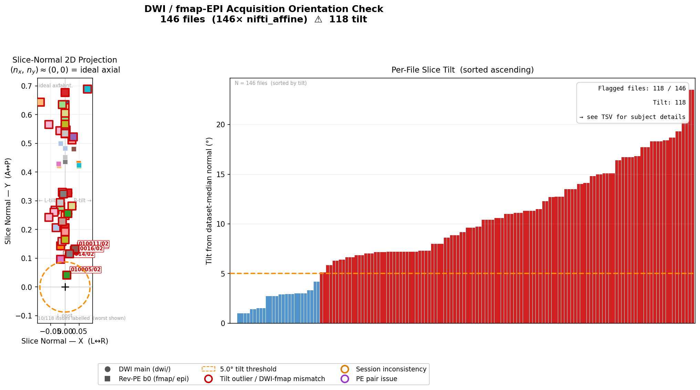

# BIDS-Inspector

Validate and summarise a [BIDS](https://bids-specification.readthedocs.io/) dataset. Scans all subjects and sessions, auto-discovers every acquisition type, and produces a single CSV showing what is present, what is missing, and where data looks off.

## What it checks

| Check | Columns produced |
|---|---|
| NIfTI + JSON sidecar present | `<acq>` (1/0), `<acq>_nii` (kept only when JSON status differs) |
| 4th dimension (func bold, DWI, fmap EPI) | `<acq>_dim4`, `<acq>_dim4_ok` (0 = deviates from dataset mode) |
| events.tsv for functional tasks | `<acq>_events` (1/0), `<acq>_events_nrows` |
| bval/bvec for DWI | `<acq>_bval`, `<acq>_bval_n`, `<acq>_bvec`, `<acq>_bvec_n`, `<acq>_dwi_ok` |
| participants.tsv | Merged automatically when present (sex, age, etc.) |

Columns that are never relevant (e.g. events.tsv when no task has one, or `_nii` when JSON is always present) are dropped automatically to keep the output clean.

## Requirements

- Python 3.10+
- nibabel
- pandas

## Usage

```bash
# Basic usage
python3 bids_inspector.py /path/to/bids

# Custom output file
python3 bids_inspector.py /path/to/bids -o results.csv

# Skip NIfTI header reading (faster, no dim4 columns)
python3 bids_inspector.py /path/to/bids --no-dim4

# Parallel processing (4 threads)
python3 bids_inspector.py /path/to/bids -j 4

# Custom log file location
python3 bids_inspector.py /path/to/bids --log run.log
```

## Output

- **CSV** (default: `bids_inspector.csv`) with one row per subject/session
- **Log** (default: `bids_inspector.log`) mirrors all console output, including warnings about dim4 outliers or DWI mismatches

## Example output (truncated)

```
subject  sex  age  func_task-rest_run-01_bold  func_task-rest_run-01_bold_dim4  func_task-rest_run-01_bold_dim4_ok  anat_T1w  dwi_dwi  ...
sub-01   F    26   1                           300                              1                                   1         1        ...
sub-02   M    24   1                           300                              1                                   1         1        ...
sub-03   F    27   1                           298                              0                                   1         0        ...
```

## JSON sidecar resolution

Follows BIDS inheritance: checks for a matching `.json` in the same directory, then walks up through session, subject, and dataset root levels.

## Tested with

- [ds000001](https://openneuro.org/datasets/ds000001) — single-session, functional task (Balloon Analog Risk Task), 16 subjects
- [ds000221](https://openneuro.org/datasets/ds000221) — multi-session, DWI + resting-state fMRI + fieldmaps, 24 subjects

---

## dwi_orientation_check.py

A companion script for catching acquisition-planning problems specific to DWI and fieldmap EPI sequences. While `bids_inspector.py` checks *what* data exist, this script checks *how* the data were acquired — specifically whether slice orientation and phase-encoding setup are consistent across subjects and sessions.

### Background and motivation

MRI sequences are planned by the MRI technician on a per-subject basis. Ideally all subjects in a study are scanned with exactly the same orientation, but in practice small variations creep in: slightly tilted slices, accidentally swapped AP/PA directions, or a sequence re-planned differently in a later session. These issues are invisible in the file names and rarely caught by standard BIDS validators, yet they can silently break preprocessing steps like topup/eddy fieldmap correction or slice-timing correction.

### What it checks

#### Check 1 — Slice tilt outliers
For each DWI and fmap EPI file the script extracts the **slice normal vector** — the direction perpendicular to the image plane. The primary source is `ImageOrientationPatientDICOM` from the JSON sidecar (a 6-element array encoding the row and column directions of the image in patient space). If that field is absent (e.g. anonymised open data), the NIfTI affine matrix is used as a fallback.

The dataset-median slice normal is computed as a robust reference. Any file whose slice normal deviates from that reference by more than `--threshold` degrees (default 5°) is flagged as a tilt outlier. This catches subjects whose sequences were accidentally planned at a different angle — a common issue when the MRI operator manually adjusts the prescription rather than copying from a previous session.

#### Check 2 — Phase-encoding direction pairs
DWI fieldmap correction (topup/eddy) requires a pair of b0 volumes acquired with **opposite phase-encoding (PE) directions** (e.g. AP and PA, or RL and LR). If the pair is missing or both volumes have the same PE direction, topup cannot estimate the susceptibility-induced distortion field.

The script reads `PhaseEncodingDirection` from each JSON sidecar, normalises both `j-` (BIDS spec) and the common variant `-j` (leading-minus notation), and checks that every fmap EPI has a valid reverse-PE partner. Two valid configurations are recognised:

- **`ok`** — two fmap EPI files with the same acquisition key but opposite PE directions (classic pair within `fmap/`)
- **`ok_with_dwi`** — a single fmap EPI whose `IntendedFor` DWI main scan provides the reverse-PE partner (the most common single-study DWI setup: one high-b-value DWI in AP + one b0 fmap EPI in PA)

Problem statuses: `no_partner`, `same_polarity`, `mixed_axis`, `axis_unknown`.

#### Check 3 — DWI ↔ fmap EPI orientation consistency
A fieldmap EPI is only geometrically valid for its intended DWI if **both were planned with the same slice orientation**. If the DWI was acquired axially and the fmap EPI ended up slightly tilted (or vice versa), the undistortion will be applied with a mis-registered fieldmap, introducing rather than correcting distortion.

For every fmap EPI that has an `IntendedFor` entry pointing to a DWI, the script computes the angle between the two slice normals. If the angle exceeds the threshold, the pair is flagged as `dwi_fmap_consistent: False`.

#### Check 4 — Session-to-session orientation consistency
For multi-session studies the same acquisition type should use the same slice orientation in every session of each subject. A large inter-session angular deviation indicates that the sequence was replanned differently at some point — which complicates longitudinal comparisons and may indicate other protocol drift.

Files sharing the same acquisition key (filename without `sub-` and `ses-` entities) are grouped per subject across sessions. The maximum pairwise angular deviation is reported in `session_max_deviation_deg`; anything above the threshold is flagged as `session_consistent: False`.

### Usage

```bash
# Basic — writes dwi_orientation_check.tsv, .png, .log
python3 dwi_orientation_check.py /path/to/bids

# Custom output prefix
python3 dwi_orientation_check.py /path/to/bids -o sub02_check

# Stricter threshold (2°) and no plot
python3 dwi_orientation_check.py /path/to/bids -t 2.0 --no-plot

# Custom log file location
python3 dwi_orientation_check.py /path/to/bids --log qc/run.log

# Suppress log file entirely
python3 dwi_orientation_check.py /path/to/bids --no-log
```

### Output files

| File | Description |
|---|---|
| `<prefix>.tsv` | Per-file report (tab-separated; one row per DWI / fmap EPI file) |
| `<prefix>.png` | Two-panel scatter + bar plot (requires matplotlib) |
| `<prefix>.log` | Full copy of all console output |

Key columns in the TSV:

| Column | Description |
|---|---|
| `slice_normal` | Normalised slice normal vector `[nx, ny, nz]` |
| `orientation_source` | `json_iop` (DICOM field) or `nifti_affine` (fallback) |
| `tilt_from_cardinal` | Angle from nearest cardinal axis (axial/coronal/sagittal) |
| `tilt_from_median_deg` | Angle from dataset-median normal (Check 1 metric) |
| `tilt_outlier` | `True` if tilt_from_median_deg > threshold |
| `pe_pair_status` | `ok` / `ok_with_dwi` / `no_partner` / `same_polarity` / … |
| `dwi_fmap_angle_deg` | Angle between fmap EPI and its IntendedFor DWI (Check 3) |
| `dwi_fmap_consistent` | `True/False` for fmap EPIs linked via IntendedFor |
| `session_max_deviation_deg` | Worst pairwise inter-session angle for this subject/acq (Check 4) |
| `session_consistent` | `True/False` for multi-session subjects |

### Example output

The plot below was generated from [ds000221](https://openneuro.org/datasets/ds000221) (20 subjects, 2 sessions each, DWI + resting-state fMRI + fieldmaps). Orientation data was read from NIfTI affines (no `ImageOrientationPatientDICOM` in this anonymised open dataset). All fmap EPI AP/PA pairs are correctly detected as `ok`; tilt outliers reflect the variable sequence planning typical of a public multi-site dataset.



### Python API

```python
from dwi_orientation_check import check_dwi_orientation

df = check_dwi_orientation(
    bids_root='/path/to/bids',
    output_prefix='qc/my_dataset',
    threshold_deg=5.0,
    plot=True,
    log_file='qc/my_dataset.log',   # None to disable
)
```

---

Built with [Claude Code](https://claude.ai/claude-code).
